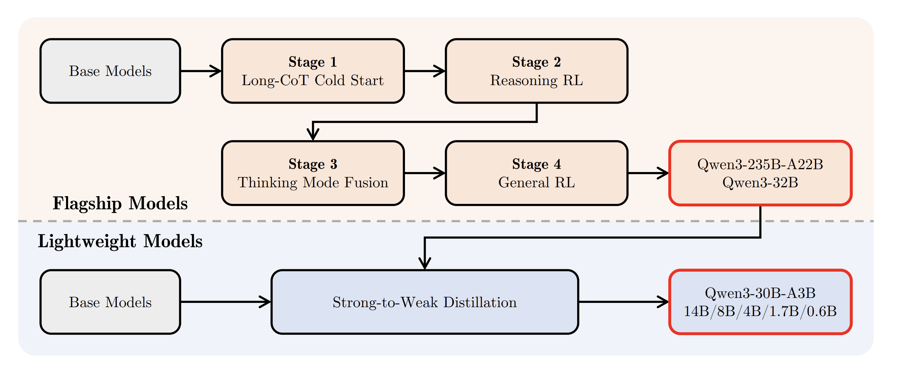

# Agents explained

[Everyone is talking about agents](https://x.com/gdb/status/1923541152508281329). Hardly a week goes by without major AI labs announcing an [impressive agent demo](https://www.youtube.com/live/8UWKxJbjriY?si=XpSQ1-oMWalBUC4f&t=835) or an [agent](https://openai.com/index/new-tools-for-building-agents/) [building](https://www.anthropic.com/engineering/building-agents-with-the-claude-agent-sdk) [toolkit](https://www.anthropic.com/engineering/equipping-agents-for-the-real-world-with-agent-skills). They’ve allowed millions to vibe-code their way to (internet) fame and they are the subject of endless [social media commentary](https://x.com/karpathy/status/1979644538185752935). But, what are agents exactly? How are they built and trained? How do they relate to large language models (LLMs) or chatbots? 

In this blog post we’ll cover the mechanics of agents, or how you get from a pure text-generator to something that can take real-life actions. We’ll walk you step by step through an example you can follow in our interactive visualization. We’ll then cover what advances in the field made agents possible and effective in recent months.

<workflow-viz>
<workflow-step id="user-query" label="User Query" subtitle="Plan a weekend trip..." color="#10b981" icon="User">
<tier2>

The user provides a query.

"Plan a weekend trip in Copenhagen."

</tier2>
<tier3>
&lt;|im_start|&gt;
user
Plan a weekend trip in Copenhagen
&lt;|im_end|&gt;
</tier3>
</workflow-step>
<workflow-step id="thinking" label="Thinking" subtitle="I need to first..." color="#f59e0b" icon="Ai">
<tier2>

The model generates reasoning to analyze the problem and plan tool calls.

To plan a weekend trip, I need weather information and activity recommendations. I'll use
<code>get_weather</code>
to check conditions, then
<code>web_search</code>
for activities.

</tier2>
<tier3>
&lt;|im_start|&gt;
assistant
&lt;think&gt;
To plan a weekend trip, I need weather information and activity recommendations. I'll use
get_weather
to check conditions, then
web_search
for activities.
&lt;/think&gt;
&lt;|im_end|&gt;
</tier3>
</workflow-step>
<workflow-step id="get-weather" label="Weather Tool" subtitle="Get weather..." color="#8b5cf6" icon="BuildTool">
<tier2>

The agent issues a tool call with function name and arguments.

<pre>
{
  "name": "get_weather",
  "arguments": {
    "location": "Copenhagen, Denmark",
    "unit": "celsius"
  }
}</pre>

</tier2>
<tier3>
&lt;|im_start|&gt;
assistant
&lt;tool_call&gt;
{"name": "get_weather", "arguments": {"location": "Copenhagen, Denmark", "unit": "celsius"} }
&lt;/tool_call&gt;
&lt;|im_end|&gt;
&lt;|im_start|&gt;
system
&lt;tool_response&gt;
{"temperature": 20, "condition": "Partly Cloudy", "humidity": 65, "wind_speed": 12, "location": "Copenhagen, Denmark", "unit": "celsius"}
&lt;/tool_response&gt;
&lt;|im_end|&gt;
</tier3>
</workflow-step>
<workflow-step id="web-search" label="Search Tool" subtitle="Search web..." color="#8b5cf6" icon="BuildTool">
<tier2>

The agent issues another tool call.

<pre>
{
  "name": "web_search",
  "arguments": {
    "query": "weekend activities Copenhagen"
  }
}</pre>

</tier2>
<tier3>
&lt;|im_start|&gt;
assistant
&lt;tool_call&gt;
{"name": "web_search", "arguments": {"query": "weekend activities Copenhagen"}}
&lt;/tool_call&gt;
&lt;|im_end|&gt;
&lt;|im_start|&gt;
system
&lt;tool_response&gt;
{"results": [{"title": "Copenhagen Weekend Guide", "snippet": "Visit Tivoli Gardens, stroll through Nyhavn, explore Rosenborg Castle, or bike the city center."}], "search_query": "weekend activities Copenhagen"}
&lt;/tool_response&gt;
&lt;|im_end|&gt;
</tier3>
</workflow-step>
<workflow-step id="final-response" label="Final Response" subtitle="Here is a plan..." color="#06b6d4" icon="Chat">
<tier2>

The agent provides the weekend plan.

"Copenhagen will be 20°C and partly cloudy this weekend. I recommend Tivoli Gardens, Nyhavn waterfront, or Rosenborg Castle."

</tier2>
<tier3>
&lt;|im_start|&gt;
assistant
Copenhagen will be 20°C and partly cloudy this weekend. I recommend Tivoli Gardens, Nyhavn waterfront, or Rosenborg Castle.
&lt;|im_end|&gt;
</tier3>
</workflow-step>
<workflow-styles>
.tier3__content .role-user { color: var(--color-user, #10b981); } .tier3__content .role-thinking { color: var(--color-thinking, #f59e0b); } .tier3__content .role-tool { color: var(--color-tool, #8b5cf6); } .tier3__content .role-response { color: var(--color-response, #06b6d4); } .tier3__content .syntax { color: var(--color-syntax, #94a3b8); }
</workflow-styles>
</workflow-viz>

In short, an agent is [an LLM acting with tools in a loop to achieve a goal](https://simonwillison.net/2025/Sep/18/agents/). Tools define code the agent can execute, analogous to the functions a programmer would call – hence LLMs that can use tools are sometimes called [“function-calling”](https://gorilla.cs.berkeley.edu/leaderboard.html). Tools can do two things: retrieve useful information, like performing web searches; and change the state of the world, like ordering groceries. The agent achieves its objective by interleaving multiple rounds of reasoning and tool calling, and by maintaining context ([memory](https://www.youtube.com/watch?v=IS_y40zY-hc)) about its progress towards its objective.

### How does it work?

Let’s illustrate with an example. Suppose you are in Copenhagen for a few days and ask an agent to plan your weekend trip. In response to your query, it will reason about your question and the information it needs to complete the task, similar to the way [reasoning](https://openai.com/o1/) [models](https://huggingface.co/deepseek-ai/DeepSeek-R1) approach a complex problem by decomposing it in a few steps.

<workflow-viz interactive="false" step="1" expanded="true">
<workflow-step id="user-query" label="User Query" subtitle="Plan a weekend trip..." color="#10b981" icon="User"></workflow-step>
<workflow-step id="thinking" label="Thinking" subtitle="I need to first..." color="#f59e0b" icon="Ai">
<tier2>

The model generates reasoning to analyze the problem and plan tool calls.

To plan a weekend trip, I need weather information and activity recommendations. I'll use
<code>get_weather</code>
to check conditions, then
<code>web_search</code>
for activities.

</tier2>
<tier3>
&lt;|im_start|&gt;
assistant
&lt;think&gt;
To plan a weekend trip, I need weather information and activity recommendations. I'll use
get_weather
to check conditions, then
web_search
for activities.
&lt;/think&gt;
&lt;|im_end|&gt;
</tier3>
</workflow-step>
<workflow-step id="get-weather" label="Weather Tool" subtitle="Get weather..." color="#8b5cf6" icon="BuildTool"></workflow-step>
<workflow-step id="web-search" label="Search Tool" subtitle="Search web..." color="#8b5cf6" icon="BuildTool"></workflow-step>
<workflow-step id="final-response" label="Final Response" subtitle="Here is a plan..." color="#06b6d4" icon="Chat"></workflow-step>
<workflow-styles>
.tier3__content .role-user { color: var(--color-user, #10b981); } .tier3__content .role-thinking { color: var(--color-thinking, #f59e0b); } .tier3__content .role-tool { color: var(--color-tool, #8b5cf6); } .tier3__content .role-response { color: var(--color-response, #06b6d4); } .tier3__content .syntax { color: var(--color-syntax, #94a3b8); }
</workflow-styles>
</workflow-viz>

The agent will then execute its plan, which might involve getting information about the weather or upcoming events. However, the only thing LLMs can read and write are [tokens](https://help.openai.com/en/articles/4936856-what-are-tokens-and-how-to-count-them). We need a way to translate tool information and calls to a list of tokens. In agents, this is done in a similar way as in chatbots, where conversations are encoded as a list of _turns_ with associated roles (system, user, assistant). In the case of tool-calling agents, we will add additional tool turn types (tool call and tool response).

Tool names and definitions are added to the system turn, so the model has them in context and knows when to use them. To convert from a list of turns to a sequence of tokens, the application will use the model's [chat template](https://huggingface.co/docs/transformers/main/en/chat_templating), a specialized piece of code shipped with the model (for instance on [Hugging Face](https://huggingface.co/Qwen/Qwen3-4B/tree/main) or [Github](https://github.com/openai/harmony) for open models).

<workflow-viz interactive="false" step="1" expanded="true">
<workflow-step id="user-query" label="User Query" subtitle="Plan a weekend trip..." color="#10b981" icon="User"></workflow-step>
<workflow-step id="thinking" label="Thinking" subtitle="I need to first..." color="#f59e0b" icon="Ai">
<tier2>

The model generates reasoning to analyze the problem and plan tool calls.

To plan a weekend trip, I need weather information and activity recommendations. I'll use
<code>get_weather</code>
to check conditions, then
<code>web_search</code>
for activities.

</tier2>
<tier3>
&lt;|im_start|&gt;
assistant
&lt;think&gt;
To plan a weekend trip, I need weather information and activity recommendations. I'll use
get_weather
to check conditions, then
web_search
for activities.
&lt;/think&gt;
&lt;|im_end|&gt;
</tier3>
</workflow-step>
<workflow-step id="get-weather" label="Weather Tool" subtitle="Get weather..." color="#8b5cf6" icon="BuildTool"></workflow-step>
<workflow-step id="web-search" label="Search Tool" subtitle="Search web..." color="#8b5cf6" icon="BuildTool"></workflow-step>
<workflow-step id="final-response" label="Final Response" subtitle="Here is a plan..." color="#06b6d4" icon="Chat"></workflow-step>
<workflow-styles>
.tier3__content .role-user { color: var(--color-user, #10b981); } .tier3__content .role-thinking { color: var(--color-thinking, #f59e0b); } .tier3__content .role-tool { color: var(--color-tool, #8b5cf6); } .tier3__content .role-response { color: var(--color-response, #06b6d4); } .tier3__content .syntax { color: var(--color-syntax, #94a3b8); }
</workflow-styles>
</workflow-viz>

The specific chat format depends on how the model was trained (our example uses the Qwen 3 chat template), but this usually involves separating turns with special tokens and annotating the turn type at the beginning (system, user, assistant, tool). For reasoning within the assistant turn, the model uses special \<think\> tags. Another special token (the end-of-turn) is used to signal that the LLM should stop generating, at which point the user should be queried or tools should be executed.

Tool calls are formatted as structured outputs (dictionary in [JSON](https://en.wikipedia.org/wiki/JSON) format), and parsed by the app running the agent:

<workflow-viz interactive="false" step="2" expanded="true">
<workflow-step id="user-query" label="User Query" subtitle="Plan a weekend trip..." color="#10b981" icon="User"></workflow-step>
<workflow-step id="thinking" label="Thinking" subtitle="I need to first..." color="#f59e0b" icon="Ai"></workflow-step>
<workflow-step id="get-weather" label="Weather Tool" subtitle="Get weather..." color="#8b5cf6" icon="BuildTool">
<tier2>

The agent issues a tool call with function name and arguments.

<pre>
{
  "name": "get_weather",
  "arguments": {
    "location": "Copenhagen, Denmark",
    "unit": "celsius"
  }
}</pre>

</tier2>
<tier3>
&lt;|im_start|&gt;
assistant
&lt;tool_call&gt;
{"name": "get_weather", "arguments": {"location": "Copenhagen, Denmark", "unit": "celsius"} }
&lt;/tool_call&gt;
&lt;|im_end|&gt;
&lt;|im_start|&gt;
system
&lt;tool_response&gt;
{"temperature": 20, "condition": "Partly Cloudy", "humidity": 65, "wind_speed": 12, "location": "Copenhagen, Denmark", "unit": "celsius"}
&lt;/tool_response&gt;
&lt;|im_end|&gt;
</tier3>
</workflow-step>
<workflow-step id="web-search" label="Search Tool" subtitle="Search web..." color="#8b5cf6" icon="BuildTool"></workflow-step>
<workflow-step id="final-response" label="Final Response" subtitle="Here is a plan..." color="#06b6d4" icon="Chat"></workflow-step>
<workflow-styles>
.tier3__content .role-user { color: var(--color-user, #10b981); } .tier3__content .role-thinking { color: var(--color-thinking, #f59e0b); } .tier3__content .role-tool { color: var(--color-tool, #8b5cf6); } .tier3__content .role-response { color: var(--color-response, #06b6d4); } .tier3__content .syntax { color: var(--color-syntax, #94a3b8); }
</workflow-styles>
</workflow-viz>

The fields in this JSON are used to determine how to execute the call. In our example, the weather tool takes in two arguments: the `location` and the `unit`. Tool invocation works like this:

1. The model predicts the name of the tool and all arguments in JSON format in the tool call turn,
2. The end-of-turn token is detected,
3. The app parses the JSON and executes the tool, calling an external weather API with our arguments,
4. It returns the result as part of a tool response turn.

<workflow-viz interactive="false" step="2" expanded="true">
<workflow-step id="user-query" label="User Query" subtitle="Plan a weekend trip..." color="#10b981" icon="User"></workflow-step>
<workflow-step id="thinking" label="Thinking" subtitle="I need to first..." color="#f59e0b" icon="Ai"></workflow-step>
<workflow-step id="get-weather" label="Weather Tool" subtitle="Get weather..." color="#8b5cf6" icon="BuildTool">
<tier2>

The agent issues a tool call with function name and arguments.

<pre>
{
  "name": "get_weather",
  "arguments": {
    "location": "Copenhagen, Denmark",
    "unit": "celsius"
  }
}</pre>

</tier2>
<tier3>
&lt;|im_start|&gt;
assistant
&lt;tool_call&gt;
{"name": "get_weather", "arguments": {"location": "Copenhagen, Denmark", "unit": "celsius"} }
&lt;/tool_call&gt;
&lt;|im_end|&gt;
&lt;|im_start|&gt;
system
&lt;tool_response&gt;
{"temperature": 20, "condition": "Partly Cloudy", "humidity": 65, "wind_speed": 12, "location": "Copenhagen, Denmark", "unit": "celsius"}
&lt;/tool_response&gt;
&lt;|im_end|&gt;
</tier3>
</workflow-step>
<workflow-step id="web-search" label="Search Tool" subtitle="Search web..." color="#8b5cf6" icon="BuildTool"></workflow-step>
<workflow-step id="final-response" label="Final Response" subtitle="Here is a plan..." color="#06b6d4" icon="Chat"></workflow-step>
<workflow-styles>
.tier3__content .role-user { color: var(--color-user, #10b981); } .tier3__content .role-thinking { color: var(--color-thinking, #f59e0b); } .tier3__content .role-tool { color: var(--color-tool, #8b5cf6); } .tier3__content .role-response { color: var(--color-response, #06b6d4); } .tier3__content .syntax { color: var(--color-syntax, #94a3b8); }
</workflow-styles>
</workflow-viz>

The weather looks warm but partly cloudy this weekend, so the model could search for nice walking routes around the city, by using an internet search tool and reading the content of retrieved web pages:

<workflow-viz interactive="false" step="3" expanded="true">
<workflow-step id="user-query" label="User Query" subtitle="Plan a weekend trip..." color="#10b981" icon="User"></workflow-step>
<workflow-step id="thinking" label="Thinking" subtitle="I need to first..." color="#f59e0b" icon="Ai"></workflow-step>
<workflow-step id="get-weather" label="Weather Tool" subtitle="Get weather..." color="#8b5cf6" icon="BuildTool"></workflow-step>
<workflow-step id="web-search" label="Search Tool" subtitle="Search web..." color="#8b5cf6" icon="BuildTool">
<tier2>

The agent issues another tool call.

<pre>
{
  "name": "web_search",
  "arguments": {
    "query": "weekend activities Copenhagen"
  }
}</pre>

</tier2>
<tier3>
&lt;|im_start|&gt;
assistant
&lt;tool_call&gt;
{"name": "web_search", "arguments": {"query": "weekend activities Copenhagen"}}
&lt;/tool_call&gt;
&lt;|im_end|&gt;
&lt;|im_start|&gt;
system
&lt;tool_response&gt;
{"results": [{"title": "Copenhagen Weekend Guide", "snippet": "Visit Tivoli Gardens, stroll through Nyhavn, explore Rosenborg Castle, or bike the city center."}], "search_query": "weekend activities Copenhagen"}
&lt;/tool_response&gt;
&lt;|im_end|&gt;
</tier3>
</workflow-step>
<workflow-step id="final-response" label="Final Response" subtitle="Here is a plan..." color="#06b6d4" icon="Chat"></workflow-step>
<workflow-styles>
.tier3__content .role-user { color: var(--color-user, #10b981); } .tier3__content .role-thinking { color: var(--color-thinking, #f59e0b); } .tier3__content .role-tool { color: var(--color-tool, #8b5cf6); } .tier3__content .role-response { color: var(--color-response, #06b6d4); } .tier3__content .syntax { color: var(--color-syntax, #94a3b8); }
</workflow-styles>
</workflow-viz>

The agent will then have enough information to give you a few alternatives on how to best enjoy the city.

<workflow-viz interactive="false" step="4" expanded="true">
<workflow-step id="user-query" label="User Query" subtitle="Plan a weekend trip..." color="#10b981" icon="User"></workflow-step>
<workflow-step id="thinking" label="Thinking" subtitle="I need to first..." color="#f59e0b" icon="Ai"></workflow-step>
<workflow-step id="get-weather" label="Weather Tool" subtitle="Get weather..." color="#8b5cf6" icon="BuildTool"></workflow-step>
<workflow-step id="web-search" label="Search Tool" subtitle="Search web..." color="#8b5cf6" icon="BuildTool"></workflow-step>
<workflow-step id="final-response" label="Final Response" subtitle="Here is a plan..." color="#06b6d4" icon="Chat">
<tier2>

The agent provides the weekend plan.

"Copenhagen will be 20°C and partly cloudy this weekend. I recommend Tivoli Gardens, Nyhavn waterfront, or Rosenborg Castle."

</tier2>
<tier3>
&lt;|im_start|&gt;
assistant
Copenhagen will be 20°C and partly cloudy this weekend. I recommend Tivoli Gardens, Nyhavn waterfront, or Rosenborg Castle.
&lt;|im_end|&gt;
</tier3>
</workflow-step>
<workflow-styles>
.tier3__content .role-user { color: var(--color-user, #10b981); } .tier3__content .role-thinking { color: var(--color-thinking, #f59e0b); } .tier3__content .role-tool { color: var(--color-tool, #8b5cf6); } .tier3__content .role-response { color: var(--color-response, #06b6d4); } .tier3__content .syntax { color: var(--color-syntax, #94a3b8); }
</workflow-styles>
</workflow-viz>

You might have also heard about MCPs in the context of AI agents. MCP ([Model Context Protocol](https://modelcontextprotocol.io/docs/getting-started/intro)) is a standard that allows developers to define tools for their application in a common format. It is a commonly agreed upon interface for agents to access app functionality, whether that be access to [calendar apps](https://mcpservers.org/servers/Shameerpc5029/google-calendar-mcp), [web searches](https://github.com/pskill9/web-search), [databases](https://github.com/crystaldba/postgres-mcp), or actions with workplace software like [Slack](https://mcp.so/server/slack) or [Linear](https://linear.app/docs/mcp). By making an MCP to connect to their apps, developers ensure most agents will be able to access them automatically without further tuning!

### Why does it work now?

Simply put, for agents to work in the real world, two things needed to happen. First, pretraining on large-scale datasets was required to teach models general-purpose knowledge about all human activities. And second, large-scale reinforcement learning (RL) on LLMs with tool use needed to come online, to extract useful behaviors from the glorified autocomplete you get out of pretraining.

Discussions about agents are not new: the term originates from RL research ([dating to the 90s](http://incompleteideas.net/book/the-book-1st.html)) and describes any entity interacting autonomously with an environment. RL agents from before the LLM era managed to grab some [impressive achievements](https://www.youtube.com/watch?v=Lu56xVlZ40M) in [games](https://deepmind.google/research/projects/alphago/) or [specialized robotics](https://openai.com/index/solving-rubiks-cube/), but all attempts to create the kind of general-purpose agent that can complete useful tasks on your behalf [proved elusive](https://openai.com/index/universe/). This is because these agents were trained from scratch, having to learn, for instance, to fill a text field in a browser by performing random actions. Building agents on top of LLMs, which possess knowledge of the world, eliminated this problem.

However, an LLM is not an agent. Base LLMs, fresh after pretraining, are not even amenable to simple instructions: they just complete text in the way that most resembles their training data (web pages and books). Hardly good behavior for tool calling! Making LLMs usable, either as chatbots or agents, requires [extensive post-training](https://www.adaptive-ml.com/post/from-zero-to-ppo). In recent years, the post-training pipeline of all foundation models, whether frontier or open-source, has started to include increasingly more agentic training, including reasoning and tool use with reinforcement learning. For instance, see [Qwen's 3 training pipeline](https://arxiv.org/abs/2505.09388):

[Training agents to reason](https://openai.com/o1/) involves prompting the model to use additional tokens to think through the task step by step ([chain-of-thought](https://arxiv.org/abs/2201.11903)) before giving its final answer, scoring this answer and using RL to update the model accordingly. The emergent reasoning abilities that RL and chain-of-thought provide together was famously demonstrated in what [DeepSeek called the “aha” moment](https://www.philschmid.de/mini-deepseek-r1), when models gain ability to verify their answers without being trained explicitly to do so.

<!-- Deepseeks aha moment illustration is a bit dry -->

Tool use training involves letting models access tools, hosted on dedicated machines during training, to complete tasks. Tool execution and task completion feedback is then used to train the model via RL. RL will teach models to use tools with the right arguments and format, and will give models experience of the sort of response these tools can provide and how they can be used to answer the task at hand: imagine learning to master a complex app like Figma without ever being able to use it!

RL for reasoning and tool use has powered impressive and sustained progress on agent abilities in the past two years. In addition to reasoning and using tools correctly, this sort of training teaches agents to be [effective at exponentially longer time scales](https://metr.org/blog/2025-03-19-measuring-ai-ability-to-complete-long-tasks/), which is essential to perform complex and valuable tasks.

### What's next?

Today's agents excel at using openly available tools in general-purpose contexts; however they cannot **adapt to specific environments**, like using domain-specific knowledge or specialized tools. Building personalized assistants that can integrate deeply to your business processes will take additional work. RL taught LLMs to act as students, able to complete hard but artificial tasks. In the future, it will have an outsize role in teaching them to act as skilled and effective collaborators in the workplace**.

To learn more, check out [our work with agents](https://www.adaptive-ml.com/).
