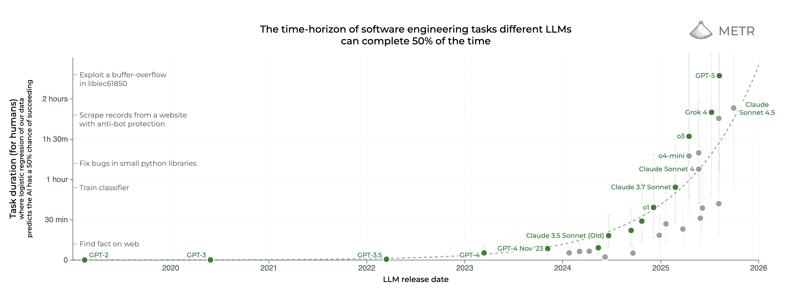

# Agents explained

Everyone is talking about AI agents. Frontier labs have put out tooling for [developers](https://openai.com/index/new-tools-for-building-agents/) [to](https://openai.com/index/introducing-agentkit/) [build](https://www.anthropic.com/engineering/equipping-agents-for-the-real-world-with-agent-skills) [them](https://www.anthropic.com/engineering/building-agents-with-the-claude-agent-sdk). 2025 has been called the [year of agents](https://x.com/gdb/status/1923541152508281329), they are the subject of widespread [social media commentary]( https://x.com/karpathy/status/1979644538185752935) and blow-your-mind [products](http://youtube.com/watch?v=6eBSHbLKuN0) and [demos](https://www.youtube.com/live/8UWKxJbjriY?si=XpSQ1-oMWalBUC4f&t=835).

What are agents exactly? How are they built and trained? How are they related to previous tech like large language models (LLMs) or chatbots?

<workflow-viz></workflow-viz>

An agent is an LLM trained to interact with the outside world, plus a code environment that allows it to do so. It acts by predicting text that activates so-called tools, like a programmer would use an API. Tools are functions in a programming language that accept arguments, perform some meaningful logic, and return outputs. The agent achieves its task by interleaving multiple rounds of reasoning (summarizing, making a plan, taking decisions) and tool calling. Tools can do two things: first, get useful information to inform decision making or return to the user; second, change the state of the world, like when ordering groceries or sending an email.

### How does it work?

Suppose you are in Copenhagen for a few days and ask an agent to plan a weekend trip. In response to your query, it will reason about your question and the information it needs, look at the weather for the next days, use the result to search for activities in the city, and finally suggest a nice weekend plan.

First, your agent will start planning its research, knowing what tools it can access. This is similar to the way [reasoning](https://openai.com/o1/) [models](https://huggingface.co/deepseek-ai/DeepSeek-R1) approach a complex problem by decomposing it in a few steps.

<workflow-viz interactive="false" step="1" expanded="false"></workflow-viz>
<!-- 
user
thinking
tool
response
syntax -->

The agent will then execute its plan. Concretely, how does this work? The only thing LLMs can read and write are [tokens](https://help.openai.com/en/articles/4936856-what-are-tokens-and-how-to-count-them), the individual components that encode strings of text. We need a way to translate tool information and calls to a list of tokens. In agents, this is done in a similar way as in chatbots, where conversations are encoded as a list of *turns* with associated roles (system, user, assistant). In the case of tool-calling agents, we will add additional tool turn types.

Tool names and definitions are added to the system turn, so the model has them in context and knows when to use them. To convert from a list of turns to a sequence of tokens, the application will use the model's [chat template](https://huggingface.co/docs/transformers/main/en/chat_templating), a specialized piece of code shipped with the model (for instance on [Hugging Face](https://huggingface.co/Qwen/Qwen3-4B/tree/main) or [Github](https://github.com/openai/harmony) for open models).

<workflow-viz interactive="false" step="1" expanded="true"></workflow-viz>

The specific chat format depends on how the model was trained (our example uses the Qwen 3 chat template), but this usually involves separating turns with special tokens and annotating the turn type at the beginning (system, user, assistant, tool).  For reasoning within the assistant turn, the model uses special \<think\> tags. Another special token (the end-of-turn) is used to signal that the LLM should stop generating, at which point the user should be queried or tools should be executed.

Tool calls are formatted as structured outputs (dictionary in [JSON](https://en.wikipedia.org/wiki/JSON) format), and parsed by the app running the agent:

<workflow-viz interactive="false" step="2" expanded="false"></workflow-viz>

The fields in this JSON are used to determine how to execute the call. In our example, the weather tool takes in two arguments: the `location` and the `unit`. Tool invocation works like this:

- The model predicts the name of the tool and all arguments in JSON format,
- The end-of-turn token is detected,
- The app parses the JSON and executes the tool, calling an external weather API with our arguments,
- It returns the result as part of an additional turn.

<workflow-viz interactive="false" step="2" expanded="true"></workflow-viz>

The weather looks warm but partly cloudy this weekend, so the model could search for nice walking routes around the city, by using an internet search tool and reading their content:

<workflow-viz interactive="false" step="3" expanded="true"></workflow-viz>

The agent will then have enough information to give you a few alternatives on how to best enjoy the city.

<workflow-viz interactive="false" step="4" expanded="false"></workflow-viz>

You might have also heard about MCPs in the context of AI agents. MCP ([Model Context Protocol](https://modelcontextprotocol.io/docs/getting-started/intro)) is a standard that allows developers to define tools for their application in a common format. It is a commonly agreed upon interface for agents to access app functionality, whether that be access to [calendar apps](https://mcpservers.org/servers/Shameerpc5029/google-calendar-mcp), [web searches](https://github.com/pskill9/web-search), [databases](https://github.com/crystaldba/postgres-mcp), or actions with workplace software like [Slack](https://mcp.so/server/slack) or [Linear](https://linear.app/docs/mcp). By making an MCP to connect to their apps, developers ensure most agents will be able to access them automatically without further tuning!

### Why does it work now?

The concept of an agent is pretty old. The term originally comes from [old-school](https://mitpress.mit.edu/9780262039246/reinforcement-learning/) reinforcement learning (RL) research and is used as a general term for any AI acting autonomously in an environment. RL is a training technique that teaches models to maximise experienced rewards in an environment. A prominent example before the LLM era is [AlphaGo](https://deepmind.google/research/projects/alphago/). Agents as personal assistants that can perform computer tasks [date back to that era](https://openai.com/index/universe/), but for them to work you need to build a layer of general understanding of the world. This has been unlocked by the increasing capabilities of LLMs trained on the entire internet. Good base LLMs, however, are not enough.

For the complex workflows that agents require, LLMs need specific capabilities that are not found in internet-scale pretraining datasets. At a basic level, LLMs need to **respect the format** required by the prompt, like the ability to write structured output without syntax errors. At a higher level, they needs to have **reasoning capabilities**, such as the ability to decompose a complex task into subtasks. And finally, they need (harder-to-define) **agentic** capabilities that allow it to act effectively and autonomously without getting derailed or confused.

<!-- Would be nice to show an agent getting confused here -->

You can't get this by imitating existing data, as [pretraining](https://openai.com/index/language-unsupervised/) and [supervised fine tuning](https://platform.openai.com/docs/guides/supervised-fine-tuning) do: this data does’t exist! Additionally, it is hard to collect at scale in a format models can use. This is why agent training is mostly done with reinforcement learning. Since RL allows you to learn from experience, models can generate their own data and the feedback teaches them what to pursue or avoid. For instance, when the model makes a formatting error, RL teaches it to avoid doing this in the future:

<workflow-viz
      interactive="false"
      step="2"
      expanded="true"
      advanced-content='{"get-weather": "<|im_start|>assistant\n<tool_call>\n{\n  \"name\": \"get_weather\",\n  \"arguments\": \"Copenhagen\"\n}\n</tool_call><|im_end|>\n\nThis tool call uses the wrong format and parsing will fail!"}'></workflow-viz>

RL has also been instrumental in [teaching](https://openai.com/o1/) [models](https://arxiv.org/abs/2501.12948) how to reason: reasoning ability [naturally emerges](https://www.philschmid.de/mini-deepseek-r1) from the combination of [chain-of-thought prompting](https://www.promptingguide.ai/techniques/cot) and RL training. This training type also reinforces agentic capabilities, since they are useful to complete long tasks and ultimately increase rewards. Today, all LLM releases (whether [frontier](https://openai.com/index/introducing-gpt-5/) or [open-source](https://arxiv.org/pdf/2505.09388)) include an extensive agentic RL training phase. This has powered impressive and sustained progress on agent abilities in the past two years, as seen in the sort of software tasks they can perform on their own. For instance, [METR](https://metr.org/) measures the [average time it takes for a human](https://metr.org/blog/2025-03-19-measuring-ai-ability-to-complete-long-tasks/) to perform tasks that agents are mastering over time, and this metric is growing exponentially:

### What's next?

Today's agents excel at using openly available tools in general-purpose contexts; however they still struggle to **adapt to specific environments** (using domain-specific knowledge, using specialized tools). Making more personalized assistants that can adapt to *your* task will take additional work, and reinforcement learning will have a central place in it.

To learn more, check out [our work with agents](https://www.adaptive-ml.com/).